# README #

This project was developed for a mobile app contest organized by 'WE CAN' at Daffodil international university.

### Summary ###

* Stop Women Violence
* Version 1.0

### Features ###

* Call to Helpline
* Request Emergency help
* Capture photo or video of an incident and send it to server with location.
* Provide necessary information

### Task List - To Do ###

* Fix Bug and update

#### Libraries ###

* [Volley](https://developer.android.com/training/volley/index.html)
* [Permission Manager](https://github.com/karanchuri/PermissionManager)
* [Android Support Library](https://developer.android.com/topic/libraries/support-library/packages.html)
* Material Showcase View
* HTTP Client
* HTTP Core
* HTTP Mime
* Ekush
* 

## Graphics ##

### Logo ###
![App Logo][logo]

[logo]: app/src/main/res/mipmap-xxxhdpi/ic_launcher.png "Stop Women Violence Logo"

### Screen Shot ###

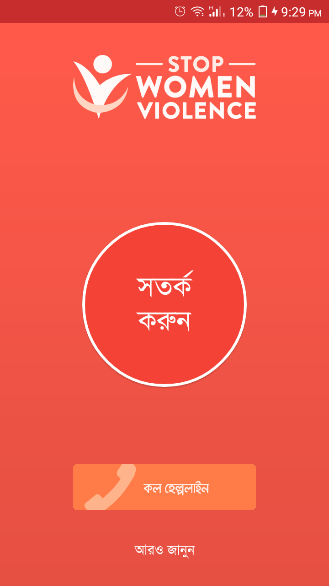 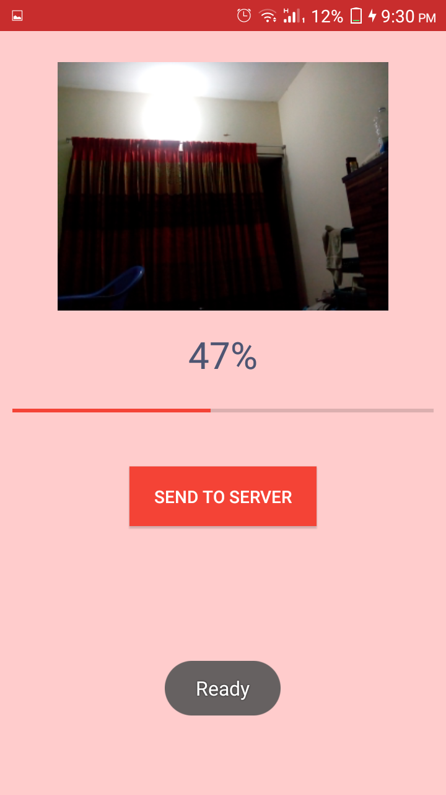 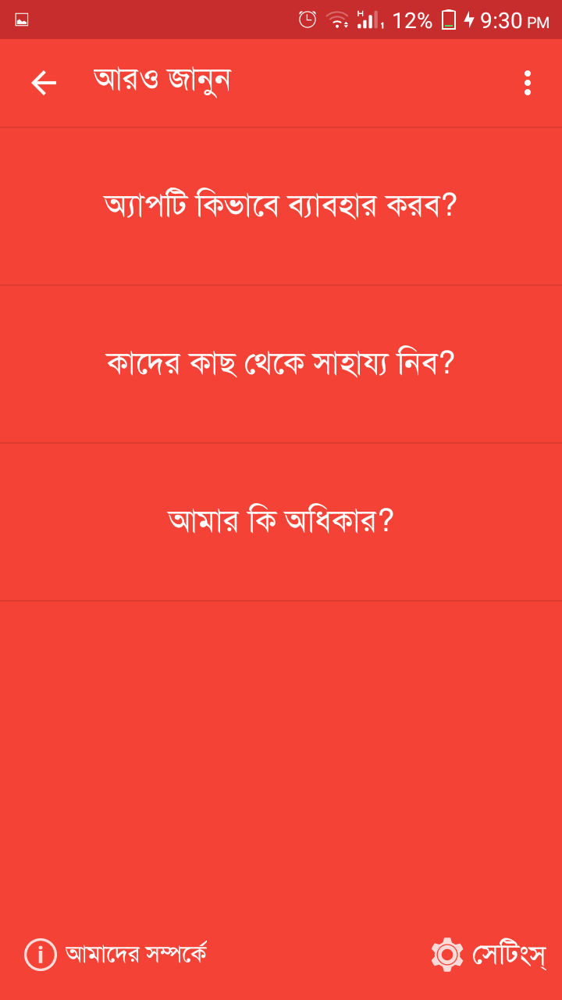 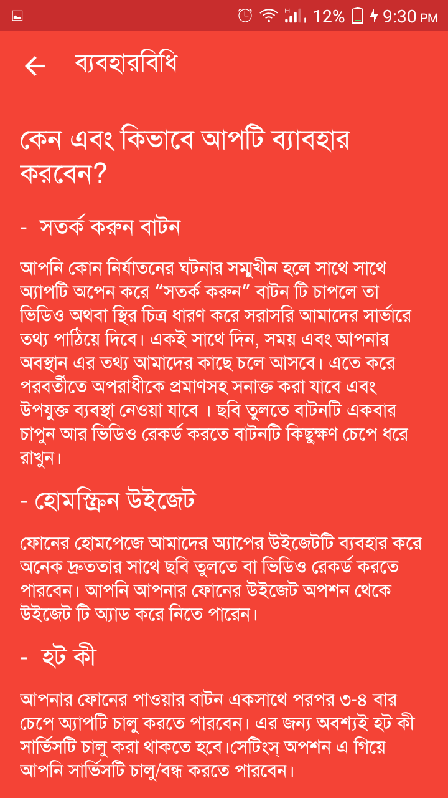
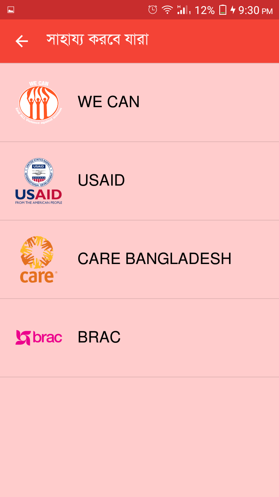 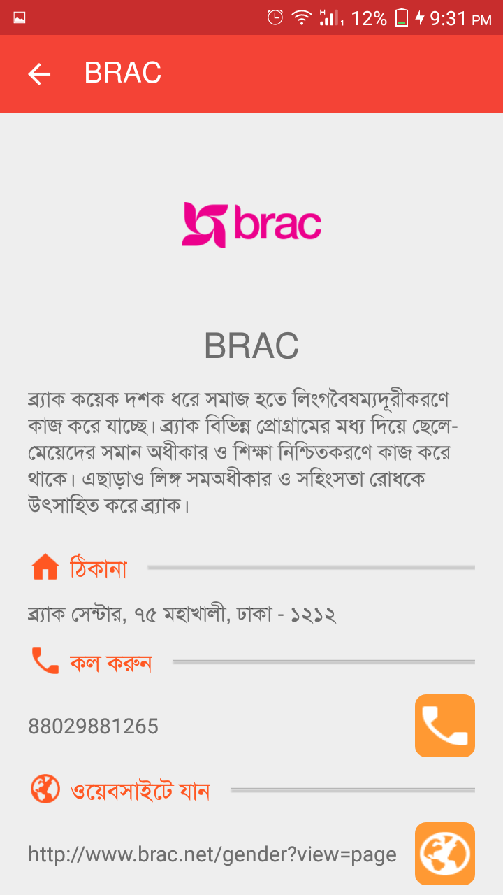 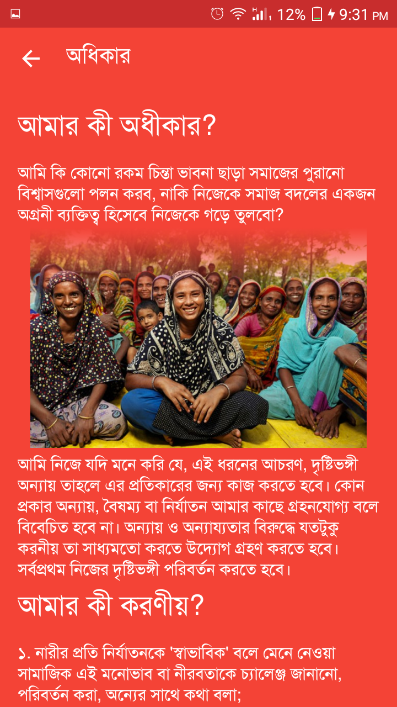 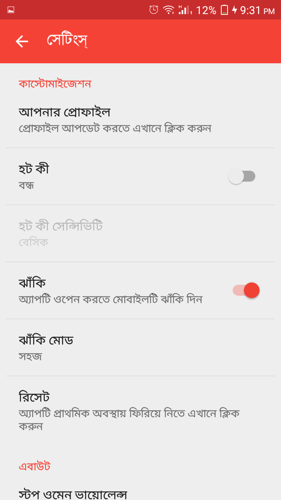
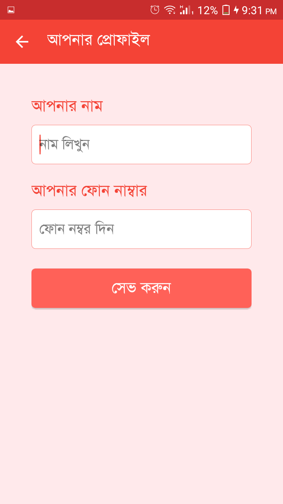 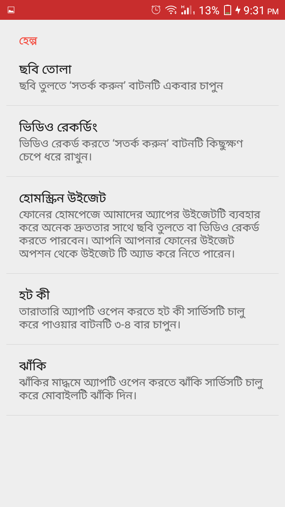 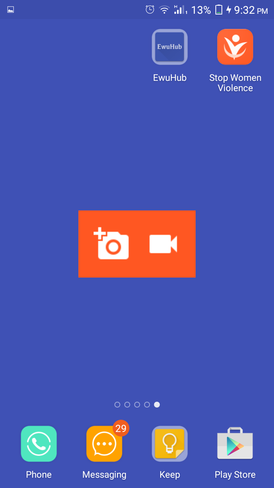 

### এই কেন অ্যাপটি ব্যাবহার করবেন এবং কিভাবে করবেন? ###

আপনি কোন নির্যাতনের ঘটনার সম্মুখীন হলে সাথে সাথে অ্যাপটি অপেন করে “সতর্ক করুন” বাটন টি চাপলে তা ভিডিও অথবা স্থির চিত্র ধারণ করে সরাসরি আমাদের সার্ভারে তথ্য পাঠিয়ে দিবে। একই সাথে দিন, সময় এবং আপনার অবস্থান এর তথ্য আমাদের কাছে চলে আসবে। এতে করে পরবর্তীতে অপরাধীকে প্রমাণসহ সনাক্ত করা যাবে এবং উপযুক্ত ব্যবস্থা নেওয়া যাবে ।

এতে আরও রয়েছে, নারী হিসাবে আপনার কি অধিকার ও করণীয় তা সম্পর্কে বিস্তারিত তথ্য। বিভিন্ন নারী সেবামূলক প্রতিষ্ঠানের তথ্য ও যোগাযোগ ঠিকানা এবং নির্যাতনের স্বীকার হলে জরুরি হেল্প লাইন ১০৯২১ এ কল করার সুযোগ।

আমরা ভবিষ্যতে আপনাদেরকে এই অ্যাপটির মাধ্যমে ঘটনা ঘটাকালীন সময়তে আপনার পাঠানো তথ্য অনুযায়ী আমাদের নিরাপত্তা বাহিনী আপনার কাছে চলে যাবে এবং উপযুক্ত ব্যবস্থা নিবে ।